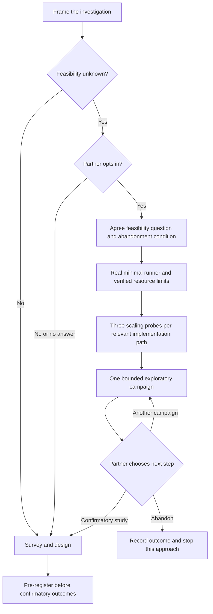

# The research workflow

[Documentation](README.md) · [Skills reference](skills-reference.md) · [Worked example](examples/solver-comparison.md)

The standard sequence protects the distinction between a prediction tested on
unused outcomes and an explanation developed after seeing them. Scale the depth
of each stage to the question while preserving that distinction.

## Standard sequence

| Stage | Skill | Evidence needed to move on |
| --- | --- | --- |
| Frame | `science-superpowers:framing-research-questions` | A specific, falsifiable question, defined measures and scope; your human partner approves the framing and reviews the written document |
| Ground | `science-superpowers:surveying-prior-work` | Cited methods, known confounds, prior effect sizes or a basis for a precision target |
| Design | `science-superpowers:designing-the-analysis` | Exact datasets, transformations, estimators, validation steps, sample-size rationale, and decision rules |
| Register | `science-superpowers:preregistering-analysis` | Frozen predictions and analysis choices before confirmatory outcomes are observed; a passing audit with its scope understood |
| Prepare | `science-superpowers:setting-up-reproducible-analysis` | Suitable workspace, pinned environment, recorded seeds, immutable raw inputs, and a verified baseline |
| Execute | `science-superpowers:subagent-driven-analysis` or `science-superpowers:executing-analysis` | Each registered step produces a validated artifact and is reviewed |
| Verify | `science-superpowers:verifying-results-before-claiming` | Fresh reproduction, inspected outputs, assumption checks, and evidence for every claim |
| Challenge | `science-superpowers:requesting-red-team-review`, then `science-superpowers:receiving-critical-review` | Critical and Important issues addressed; proposed changes checked against the registration |
| Report | `science-superpowers:reporting-and-archiving-findings` | Honest labels, limitations, reproduction instructions, and an archive; your human partner chooses what happens to the work |

Anomalies interrupt execution or verification. Use
`science-superpowers:investigating-anomalous-results` to characterize and reproduce
the problem, compare patterns, test a cause, and resolve it with evidence.

Preparatory validation uses separate known-answer data or problems. It must not
expose the relationship reserved for confirmation. Unknown feasibility should be
resolved before freezing a plan built around untested configurations.

## Choosing how to execute

Use `science-superpowers:subagent-driven-analysis` when the harness supports
delegation and the plan has mostly independent steps. It uses a fresh analyst per
step, then a protocol-compliance reviewer, then a rigor reviewer. These review
stages are ordered; launching every step simultaneously is not the workflow.

Use `science-superpowers:executing-analysis` when work must run inline. Track the
same validations and report at natural checkpoints. Without separate reviewers,
make role separation explicit and describe the review as inline.

`science-superpowers:dispatching-parallel-investigations` is for genuinely
independent questions, such as separate literature topics or unrelated anomalies.
Shared mutable artifacts and dependencies are reasons to keep work sequential.

## Feasibility mode

Feasibility mode answers whether a computational approach can run within a measured
budget. Both entry and exit belong to your human partner.



Use `science-superpowers:establishing-feasibility-first` for the full procedure.
Agree the abandonment condition before measurement, prove each kill criterion
actually fires, and persist an artifact for each probe. Additional compute needs
your human partner's agreement. A further campaign stays within the agreed budget
unless they enlarge it.

The survey, detailed design, registration, and final review are deferred. Provenance,
verification, anomaly investigation, and honest labeling stay active. Everything
produced in this mode remains exploratory. On an approved transition to a
confirmatory study, resume the survey, design, and registration sequence and test
on unused outcomes.

## Where study artifacts live

This layout is in the **research repository**. The date and topic connect related
documents; exact filenames for code and outputs are chosen in the analysis plan.

```text
research-project/
├── docs/science-superpowers/
│   ├── questions/YYYY-MM-DD-topic.md
│   ├── plans/YYYY-MM-DD-topic.md
│   ├── preregistrations/YYYY-MM-DD-topic.md
│   └── feasibility/YYYY-MM-DD-topic.md     # if opted in
├── analysis/                             # scripts or notebooks
├── data/
│   ├── raw/                              # immutable inputs
│   └── derived/                          # generated transformations
├── results/topic/                        # generated study outputs
└── reports/topic/                        # findings and review records
```

The survey skill permits a separate prior-work note or a section in the question
document. Review-record filenames and environment formats are project choices.
The audit does **not** include `data/derived/` in its default output paths; pass it
explicitly when it holds study outputs. See [audit scope](preregistration.md#audit-scope).

## When the plan changes

A code fix that restores the registered method should be documented, tested, and
followed by fresh reproduction. A new exclusion, covariate, estimator, or decision
rule changes the analysis: preserve the registration, record the deviation, and
label the affected analysis exploratory. Review feedback does not remove this
requirement. A fresh confirmatory claim needs a new registration and unused data
or runs.
